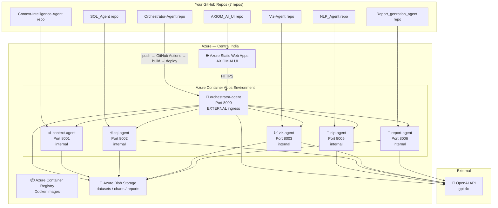

# AXIOM AI — Azure Deployment Walkthrough

> Complete guide to deploy all 7 microservices to Azure using GitHub Actions CI/CD.
> **Your choices**: Multi-repo | OpenAI | No Redis | Central India | Auto-generated URLs

---

## Step-by-Step Deployment Guide

### 📋 Prerequisites

Before starting, make sure you have:
1. **Azure Account** with active subscription ([Free trial here](https://azure.microsoft.com/free/))
2. **Azure CLI** installed ([Download for Windows](https://aka.ms/installazurecliwindows))
3. **GitHub accounts** with admin access to all 7 repositories
4. **OpenAI API key** from [platform.openai.com](https://platform.openai.com/api-keys)

---

### Step 1: Login to Azure

Open **PowerShell** (not CMD) and run:

```powershell
az login
```

This opens your browser. Sign in with your Azure account. After sign-in, note your **Subscription ID** from the output — you'll need it later.

```
# Example output:
# [
#   {
#     "id": "12345678-abcd-efgh-ijkl-mnopqrstuvwx",  ← This is your Subscription ID
#     "name": "Azure subscription 1",
#     ...
#   }
# ]
```

---

### Step 2: Create Azure Infrastructure

Run these commands one by one in PowerShell. Copy-paste each block:

#### 2.1 — Set Variables
```powershell
$RESOURCE_GROUP = "rg-axiom-ai"
$LOCATION = "centralindia"
$ACR_NAME = "acraxiomai"
$ENV_NAME = "axiom-ai-env"
```

#### 2.2 — Create Resource Group
```powershell
az group create --name $RESOURCE_GROUP --location $LOCATION
```
> [!NOTE]
> A Resource Group is just a folder in Azure that holds all your related resources together.

#### 2.3 — Create Azure Container Registry (ACR)
```powershell
az acr create `
  --resource-group $RESOURCE_GROUP `
  --name $ACR_NAME `
  --sku Basic `
  --admin-enabled true
```

> [!NOTE]
> If the name `acraxiomai` is taken (they must be globally unique), try `acraxiomai123` or similar. **The name must be lowercase, no hyphens, 5-50 characters.**

#### 2.4 — Get ACR Credentials (Save These!)

```powershell
# Get login server
az acr show --name $ACR_NAME --query loginServer --output tsv
# Example output: acraxiomai.azurecr.io

# Get password
az acr credential show --name $ACR_NAME --query "passwords[0].value" -o tsv
# Example output: AbCdEfG123456... (save this!)
```

> [!IMPORTANT]
> **Write down these three values** — you'll add them as GitHub secrets in Step 4:
> - Login Server: `acraxiomai.azurecr.io`
> - Username: `acraxiomai` (same as ACR name)
> - Password: (from the command above)

#### 2.5 — Create Container Apps Environment
```powershell
az containerapp env create `
  --name $ENV_NAME `
  --resource-group $RESOURCE_GROUP `
  --location $LOCATION
```

> [!NOTE]
> This takes 2-3 minutes. The "environment" is a secure network boundary where your agents will live and talk to each other.

#### 2.6 — Create Azure Blob Storage
```powershell
# Create storage account (name must be globally unique, lowercase, no hyphens)
az storage account create `
  --name staxiomai `
  --resource-group $RESOURCE_GROUP `
  --location $LOCATION `
  --sku Standard_LRS

# Create containers for different data types
az storage container create --name datasets --account-name staxiomai
az storage container create --name charts --account-name staxiomai
az storage container create --name reports --account-name staxiomai

# Get the connection string (SAVE THIS!)
az storage account show-connection-string --name staxiomai -o tsv
```

#### 2.7 — Create Service Principal (GitHub → Azure Auth)
```powershell
# Replace <YOUR_SUBSCRIPTION_ID> with your actual ID from Step 1
az ad sp create-for-rbac `
  --name "axiom-ai-github-cicd" `
  --role contributor `
  --scopes /subscriptions/<YOUR_SUBSCRIPTION_ID>/resourceGroups/rg-axiom-ai `
  --json-auth
```

> [!IMPORTANT]
> This command outputs a JSON block. **Copy the ENTIRE JSON output** — you'll paste it as the `AZURE_CREDENTIALS` GitHub secret.
> ```json
> {
>   "clientId": "...",
>   "clientSecret": "...",
>   "subscriptionId": "...",
>   "tenantId": "...",
>   ...
> }
> ```

---

### Step 3: Create Azure Static Web App (for UI)

This is done in the Azure Portal (website), not CLI:

1. Go to [portal.azure.com](https://portal.azure.com)
2. Search for **"Static Web Apps"** → Click **Create**
3. Fill in:
   - **Subscription**: Your subscription
   - **Resource Group**: `rg-axiom-ai`
   - **Name**: `axiom-ai-ui`
   - **Plan type**: Free
   - **Region**: Central India
   - **Source**: GitHub → Sign in → Select your **AXIOM_AI_UI** repository → Branch: `main`
4. **Build Details**:
   - Build Presets: **Next.js**
   - App location: `/`  (since the code is at the repo root)
   - Output location: `.next`
5. Click **Review + Create** → **Create**

> [!NOTE]
> Azure will automatically add a `AZURE_STATIC_WEB_APPS_API_TOKEN` secret to your AXIOM_AI_UI GitHub repository. It also creates a workflow file, but we already have ours — you can use either, or delete the auto-generated one and use ours.

---

### Step 4: Add GitHub Secrets to ALL Repositories

Since you're using multi-repo, you need to add secrets to **each** GitHub repository separately.

Go to each repo → **Settings** → **Secrets and variables** → **Actions** → **New repository secret**

#### Secrets for ALL 6 Python Agent Repos

Add these 5 secrets to each of the 6 agent repos:

| Secret Name | Value | Where to Get It |
|---|---|---|
| `AZURE_CREDENTIALS` | The full JSON from Step 2.7 | `az ad sp create-for-rbac` output |
| `REGISTRY_LOGIN_SERVER` | e.g. `acraxiomai.azurecr.io` | Step 2.4 |
| `REGISTRY_USERNAME` | e.g. `acraxiomai` | Same as ACR name |
| `REGISTRY_PASSWORD` | The password string | Step 2.4 |
| `OPENAI_API_KEY` | Your OpenAI API key | [platform.openai.com](https://platform.openai.com/api-keys) |

#### Additional Secrets for Specific Repos

These are only needed for agents that use Azure Blob Storage:

| Secret Name | Repos That Need It |
|---|---|
| `AZURE_STORAGE_CONNECTION_STRING` | Orchestrator, Context Agent, SQL Agent, Viz Agent, Report Agent |

#### Secrets for the UI Repo (AXIOM_AI_UI)

| Secret Name | Value |
|---|---|
| `AZURE_STATIC_WEB_APPS_API_TOKEN` | Auto-added by Azure in Step 3 |
| `ORCHESTRATOR_PUBLIC_URL` | Add this AFTER deploying the Orchestrator (Step 6) |

> [!TIP]
> **Shortcut**: Use the GitHub CLI to add secrets faster:
> ```bash
> gh secret set AZURE_CREDENTIALS --repo YOUR_USERNAME/Orchestrator-Agent < azure_creds.json
> gh secret set REGISTRY_LOGIN_SERVER --repo YOUR_USERNAME/Orchestrator-Agent --body "acraxiomai.azurecr.io"
> ```

---

### Step 5: Commit and Push Workflows

For each microservice repo, commit the new workflow file and push:

```powershell
# Example for Orchestrator Agent
cd d:\PROJECT\AXIOM_AI_DATAANALYSIS_v2\Orchestrator-Agent\Orchestrator-Agent
git add .github/workflows/deploy-azure.yml
git add requirements.txt  # Also push the fixed requirements
git commit -m "ci: add Azure Container Apps deployment workflow"
git push origin main
```

Repeat for all repos:

| Local Path (cd into this) | Files to Commit |
|---|---|
| `Orchestrator-Agent\Orchestrator-Agent` | `deploy-azure.yml`, `requirements.txt` |
| `Context-Intelligence-Agent` | `deploy-azure.yml` |
| `NLP_Agent\NLP_agent` | `deploy-azure.yml`, `app/config.py` |
| `SQL_Agent\SQL_Agent_Axiom_Ai` | `deploy-azure.yml`, `app/config.py` |
| `Viz-Agent\viz-agent` | `deploy-azure.yml`, `requirements.txt` |
| `Report_genration_agent\Report_genration_agent` | `deploy-azure.yml`, `requirements.txt` |
| `AXIOM_AI_UI\AXIOM_AI_UI` | `deploy-azure.yml` |

---

### Step 6: Deploy the Backend Agents (Correct Order!)

> [!WARNING]
> **Deployment order matters!** Deploy downstream agents first, then the Orchestrator last.

**Push in this order** (or trigger manually from GitHub Actions tab):

```
1. Context Intelligence Agent  ─── deploy first (no dependencies)
2. SQL Agent                   ─── deploy second
3. NLP Agent                   ─── deploy third
4. Viz Agent                   ─── deploy fourth
5. Report Agent                ─── deploy fifth
6. Orchestrator Agent          ─── deploy LAST (depends on all others)
7. AXIOM AI UI                 ─── deploy after getting Orchestrator URL
```

Each push to `main` automatically triggers the GitHub Actions workflow. You can also trigger manually:
1. Go to your GitHub repo → **Actions** tab
2. Click the workflow name → **Run workflow** → **Run workflow**

#### How to Monitor a Deployment

1. Go to the repo's **Actions** tab
2. Click on the running workflow
3. You'll see real-time logs of:
   - Docker image being built (2-5 minutes)
   - Image being pushed to ACR
   - Container being created/updated in Azure

---

### Step 7: Get the Orchestrator's Public URL

After the Orchestrator deploys:

```powershell
az containerapp show `
  --name orchestrator-agent `
  --resource-group rg-axiom-ai `
  --query "properties.configuration.ingress.fqdn" -o tsv
```

Output will look like: `orchestrator-agent.niceground-abc123.centralindia.azurecontainerapps.io`

Your full URL is: `https://orchestrator-agent.niceground-abc123.centralindia.azurecontainerapps.io`

**Now add this as a secret to the UI repo:**
1. Go to your AXIOM_AI_UI GitHub repo → Settings → Secrets
2. Add secret: `ORCHESTRATOR_PUBLIC_URL` = `https://orchestrator-agent.niceground-abc123.centralindia.azurecontainerapps.io`
3. Re-run the UI deployment workflow

---

### Step 8: Update Agent-to-Agent URLs

After all agents are deployed, update the Orchestrator to know the internal addresses of other agents:

```powershell
az containerapp update `
  --name orchestrator-agent `
  --resource-group rg-axiom-ai `
  --set-env-vars `
    "CONTEXT_AGENT_URL=http://context-agent" `
    "SQL_AGENT_URL=http://sql-agent" `
    "VIZ_AGENT_URL=http://viz-agent" `
    "NLP_AGENT_URL=http://nlp-agent" `
    "REPORT_AGENT_URL=http://report-agent"
```

> [!NOTE]
> Inside Azure Container Apps, agents find each other by name. `http://context-agent` automatically resolves to the context-agent container — no full URLs needed.

---

### Step 9: Verify Everything Works

#### 9.1 — Check Health of All Agents

```powershell
# Get the Orchestrator URL
$ORCH_URL = az containerapp show --name orchestrator-agent --resource-group rg-axiom-ai --query "properties.configuration.ingress.fqdn" -o tsv

# Test health
curl "https://$ORCH_URL/health"
```

Expected response:
```json
{
  "status": "ok",
  "service": "orchestrator-agent",
  "llm_provider": "openai",
  "llm_model": "gpt-4o"
}
```

#### 9.2 — Check API Docs

Open in your browser:
```
https://<orchestrator-url>/docs
```

#### 9.3 — Check UI

Open the Static Web App URL (found in Azure Portal → Static Web Apps → Your app → URL).

---

## Architecture Diagram (What You'll Have)



---

## Estimated Monthly Cost

| Resource | SKU | Cost |
|---|---|---|
| Container Registry | Basic | ~$5/mo |
| Container Apps (6 agents) | Consumption (scale-to-zero) | ~$0–$30/mo |
| Static Web Apps | Free | $0/mo |
| Blob Storage | Standard LRS | ~$1/mo |
| OpenAI API | Pay-per-use | Variable |
| **Total** | | **~$6–$36/mo** (excluding OpenAI) |

> Without Redis and with scale-to-zero, your idle cost is only ~$6/mo!

---

## Troubleshooting

### "Workflow failed: docker build error"
- Check that `requirements.txt` doesn't have corrupted characters
- Ensure Dockerfile is at the expected path

### "Container App fails to start"
```powershell
# Check logs
az containerapp logs show --name orchestrator-agent --resource-group rg-axiom-ai --type system
az containerapp logs show --name orchestrator-agent --resource-group rg-axiom-ai --type console
```

### "Agents can't reach each other"
- Ensure all agents are in the same Container Apps **environment** (`axiom-ai-env`)
- Ensure downstream agents have **internal** ingress enabled
- Check that agent names match exactly (Azure uses the name for DNS)

### "UI shows 'Cannot connect to API'"
- Verify `ORCHESTRATOR_PUBLIC_URL` secret is set correctly in the UI repo
- The URL must include `https://`
- Re-run the UI deployment workflow after setting the secret

### "OpenAI returns 401 Unauthorized"
- Verify `OPENAI_API_KEY` secret is set in the agent's GitHub repo
- Check you have credits/billing set up at [platform.openai.com](https://platform.openai.com)

### "ACR name already taken"
- ACR names are globally unique. Try adding numbers: `acraxiomai42`
- Update `REGISTRY_LOGIN_SERVER` secret in all repos accordingly
